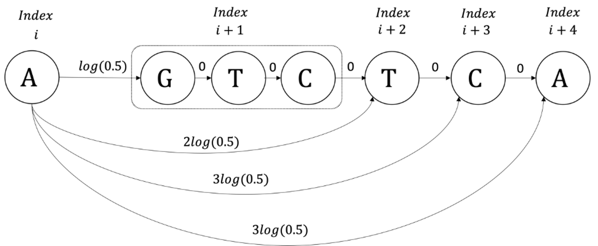

# Technion Centennial Anniversary - Computer Science Faculty
The decoder presented in this git is based on our Nature Machine Intelligence paper [link](https://www.nature.com/articles/s42256-025-01003-z)


This repository includes the methods that were used in the work.


###The repository includes the following folders.

1. CPL - Implementation of the CPL algorithm.
2. ONT's protocol that was used for sequencing.
4. Encoder_Decoder - Implemenation of our encoding and decoding algorithms.  
5. Data Utilities - Scripts that are used to parse and read our data.  

## Full End-to-End Retrieval Pipeline

To run the retrieval pipeline please use the following instructions.
1. Sequence you data according to ONT protocol, the sample include 200fmols of DNA, and should be eluted with 5 ul of water. After the elution of the sample with 5 ul of water, you can follow nanopore's protocol.
2. Following the nanopore sequencing and basecalling of your data, the next step is to perform clustering and reconstruction. This can be done by running the scripts CombinedScript2.py and then parserEvya.py that can be both found in the folder "Decoding" in this repository. Thess scripts includes primer trimming and preprocessing of the reads that are obtained from sequencing, and also binning them according to their predefined indices.
3. Next, you should run the CPL algorithm, to do so you need to compile all the cpp files that can be found in the "CPL" folder (listed under the "Decoding" folder). Compilation can be done using the makefile.  (see more instructions below)

4. Run decoder_pipeline.py that can be found in this folder. This runs the decoder including the error-correction.  

Please make sure to compile the CPL algorithm (see instructions given below on this page).

Full encoding pipeline is given in the script encode.py in Encoder_Decoder folder.

##CPL algorithm

The CPL algorithm is implemented in c++.
Installation of the g++ compiler is required (see link: https://gcc.gnu.org/).


### Compilation

Compilation is highly recommended by running the makefile command.

```bash
make
```

Alternatively, compilation can be done by running the following command.

```bash
g++ -std=c++0x -O3 -g3 -Wall -c -fmessage-length=0 -o *.cpp g++ -o main *.o
```


### Usage
To use the algorithm, it is required to bin the reads and formatting them according to the following format:

Each cluster of reads appears in the file with a header followed by the reads. More specifically:
1. The header consists of 2 lines, the first corresponds to the encoded sequence of the clusters (if the encoded sequence is unknown then the line should be emtpy line), and the second is a line of 18x“*” that should be ignored
2. The reads in the clusters are provided after the header, where each read is given in a separate line
3. Each cluster is ended with two empty lines


```bash

./main path_to_binned_file/binnedfile.txt path_to_results/ >results.txt

```

## Encoder Decoder


The encoder and decoder are implemented in python 3.8 and requires the following packages.
```bash

subprocess
galois
os
math
random
numpy
pickle
tqdm
json
os

```

### Usage


Encoding the information should be done by running the encode command in encoder.py.
The default parameters are the one that we used in our pipeline, however different redundancy can be applied by changing the code pararmeters.
```bash
python3 encode.py
```
The output of the encoder will appear in the file data_with_indices.txt, where each line corresponds to encoded sequence with its index.

Decoding should be done by running the decode command in decoder.py.
(Make sure editing the path to the inference results made by the DNN and the cpl results made by the CPL)
```bash
python3 decode.py
```

The matrix H that was used throughout our encoding process can be found in H_matrix_identity.py.

The Reed Solomon implementation was done using the schifra library [link](https://www.schifra.com/)
